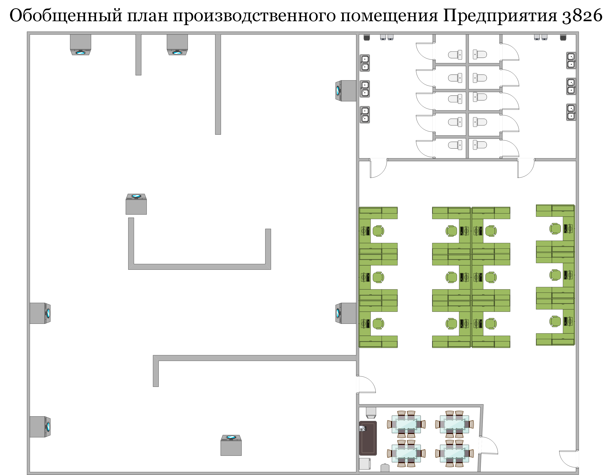

# 2. Модуль Б. Решение

Сопроводительные ссылки:

·        [https://github.com/voltbro/profi\_service\_pkg\_1](https://github.com/voltbro/profi_service_pkg_1)

·        [https://github.com/voltbro/profi\_service\_pkg\_2](https://github.com/voltbro/profi_service_pkg_2)

### _<mark style="background-color:purple;">Б1. Обновление сервисного пакета</mark>_

> **В задании написано:**
>
> Во время подготовки к сдаче задания необходимо:
>
> 1. Обновить пакет **profi\_service\_pkg\_1** до **последней версии** в удаленном репозитории;
> 2. Получить параметр конфигурации (configuration checksum), используя launch-файл сервисного пакета.

**Работа выполняется внутри робота**

**Суть задачи**: нужно склонировать на робота репозиторий с сервисным пакетом #1, затем обновить его до последней версии и запустить. После запуска появится строка с чексуммой, которую нужно продемонстрировать экспертам при оценке.

<mark style="background-color:yellow;">**Важно:**</mark> <mark style="background-color:yellow;"></mark><mark style="background-color:yellow;">все дополнительные пакеты</mark> <mark style="background-color:yellow;"></mark><mark style="background-color:yellow;">**клонируем**</mark> <mark style="background-color:yellow;"></mark><mark style="background-color:yellow;">в</mark> <mark style="background-color:yellow;"></mark><mark style="background-color:yellow;">**\~/catkin\_ws/src**</mark>

**Работаем с пакетом service\_pkg\_1**

1\) Заходим в робота

2\) Клонируем репозиторий (**первая** ссылка из задания):

Копируем ссылку на репозиторий из github:

<figure><figcaption></figcaption></figure>

В терминале внутри робота заходим в  \~/catkin\_ws/src:

```bash
cd ~/catkin_ws/src
```

клонируем репозиторий:

```bash
git clone <ссылка которую скопировали из гитхаба>
```

Терминал сообщит об успешном копировании:

<figure><figcaption></figcaption></figure>

Заходим в папку, которую склонировали:

```bash
cd profi_service_pkg_1
```

Теперь обновляем до последней версии командой git pull:

```bash
git pull origin master
```

Примерный вывод (если было, что обновлять):

<figure><figcaption></figcaption></figure>

Примерный вывод (если нечего было обновлять):

<figure><figcaption></figcaption></figure>

<mark style="color:red;">**ВАЖНО!**</mark> <mark style="color:red;"></mark><mark style="color:red;">Все нужные команды, кроме git pull вам запоминать не обязательно. Вся информация, которая написано тут, по установке и запуску пакета, написана в описании репозитория (</mark>[<mark style="color:red;">https://github.com/voltbro/profi\_service\_pkg\_1</mark>](https://github.com/voltbro/profi_service_pkg_1)<mark style="color:red;">). Эта ссылка будет доступна вам на чемпионате. Просто помните, что вы можете всегда прочитать инфу там</mark>

Теперь перед запуском пакета его надо собрать (скомпилировать). Для этого нужно вернуться в директорию catkin\_ws (директория со всеми рос пакетами):

```bash
cd ~/catkin_ws/
```

Собираем пакет командой `catkin_make --pkg <название пакета>`:

```bash
catkin_make --pkg profi_service_pkg_1
```

Компиляция займет какое-то время, если не вылезло ошибок (красные строки) и появилось примерно такое в конце вывода, то пакет скомпилирован:

<figure><figcaption></figcaption></figure>

После этого его можно запустить с помощью roslaunch:

```
roslaunch profi_service_pkg_1 start_configure.launch
```

<details>

<summary>если появилась ошибка ModuleNotFoundError: No module named 'tqdm'</summary>


Пакет не запускается, потому что в питоне не хватает модуля tqdm. Соответственно, его нужно установить:

```bash
pip3 install tqdm
```

После этого снова выполните запуск пакета:

```bash
roslaunch profi_service_pkg_1 start_configure.launch
```

</details>

Если все ок, то пакет запустится и сконфигурирует нужную вам checksum:

<figure><figcaption></figcaption></figure>

### _<mark style="background-color:purple;">Б2. Откат версии сервисного пакета</mark>_

> **В задании написано:**
>
> Во время подготовки к сдаче задания необходимо:
>
> 1. Получить список всех коммитов пакета **profi\_service\_pkg\_2**;
> 2. Откатить пакета **profi\_service\_pkg\_2** к версии **1.6.3**;
> 3. Получить параметр конфигурации (configuration checksum), используя launch-файл сервисного пакета.

В целом, действия аналогичны Б1, **но теперь работаем с пакетом service\_pkg\_2**

1\) Заходим в робота

2\) Клонируем репозиторий (**вторая** ссылка из задания):

Копируем ссылку на репозиторий из github:

<figure><figcaption></figcaption></figure>

В терминале внутри робота заходим в  \~/catkin\_ws/src:

```bash
cd ~/catkin_ws/src
```

клонируем репозиторий:

```bash
git clone <ссылка которую скопировали из гитхаба>
```

Заходим в папку, которую склонировали:

```bash
cd profi_service_pkg_2
```

Теперь нам нужно не обновить пакет, а вернуться к одной из предыдущий версий (а конкретно к версии 1.63 - это написано в задании). Чтобы найти коммит с нужной версией, выполняем `git log` или `git log --oneline`:

<figure><figcaption></figcaption></figure>

Копируем хеш-номер коммита (первые 7 символов) и выполняем переход к этой версии с помощью git checkout:

```bash
git checkout <номер коммита>
```

Если все ок, видим вывод:

<figure><figcaption></figcaption></figure>

Теперь мы в этой версии. Проверим, снова выведя лог гита: `git log --oneline`

<figure><figcaption></figcaption></figure>

Версию откатили, теперь делаем то же, что и в прошлом задании Б1 - компилируем пакет и запускаем (пользуемся описанием на гите к пакету [https://github.com/voltbro/profi\_service\_pkg\_2](https://github.com/voltbro/profi_service_pkg_2)

Перейдите в рабочую директорию вашего ROS-проекта:

```
cd ~/catkin_ws
```

Скомпилируйте пакет:

```
catkin_make
```

Запустите файл конфигурации:

ВНИМАНИЕ! сейчас в инструкции к пакету в гите написано: `roslaunch profi_service_pkg_2 start_configure.launch`

а файл в пакете называется **`start_configure_2.launch (двойка в конце)`**

**так вышло, потому что в гите мы видим инструкцию к свежей версии, а пакет-то мы откатили на одну из предыдущих!**

то есть выполняем:

```
roslaunch profi_service_pkg_2 start_configure_2.launch
```

Если launch файлы не срабатывают в любой части задания, вы можете проверить, есть ли такой файл (мб ошибка в названии) перейдя в директорию пакета (`cd ~/catkin_ws/src/<название пакета>/launch`) и выполнив там `ls -ahl.` Вы увидите список доступных файлов.

Еще один способ (это если мы **меняем версию пакета**) - это зайди в директорию пакета и вывести содержимое файла readme в терминал (cat README.md). Там вы увидите инструкцию по запуску именно вашей версии пакета

В любом случае, когда вы успешно выполните запуск, получите чексумму:

<figure><figcaption></figcaption></figure>

### Б3. Сервисная работа с bag файлами робота

> **В задании написано:**
>
> В ходе ежедневного осмотра производственного помещения робот-инспектор обнаружил превышение регламентной температуры на нескольких производственных станках. После обнаружения неисправностей, робот отправил bag файл с последним циклом обследования территории. Необходимо проанализировать присланный bag файл и указать на плане следующую информацию:
>
> 1. Точное месторасположение неисправных приборов (координаты и области на карте);
> 2. Зафиксированную температуру на неисправных приборах.
>
> Комплектация робота-инспектора:
>
> * Робот TurtleBro;
> * Комплектом расширения для сборки полезной нагрузки "Робот-инспектор": тепловизор AMG88хх 8x8 Thermal Camera Sensor, сигнальная лампа;
> * Дополнительное программное обеспечение: мета-пакет [turtlebro\_ex](https://github.com/voltbro/turtlebro_extra/)

**Суть задания:** расшифровать bag файл, который вам предоставят. Этот файл записан на каком-то другом роботе, на котором еще стоял тепловизор. По расшифрованным данным вам надо отметить на картинке (она тоже будет приложена к вашему заданию) положение перегретых устройств (отметить, указать точные координаты и температуру). Картинка для работы выглядит так:

<figure><figcaption></figcaption></figure>

Примерно так должен выглядеть ваш результат:

<figure><figcaption></figcaption></figure>

Добавить надписи на картинку можно в любом графическом редакторе, который вы найдете на нотубуке (например, встроенный GIMP)

**Работа выполняется на ноутбуке (не в роботе)**,&#x20;

**Сейчас у вас скорее всего в файле bashrc в ноутбуке прописан ROS MASTER URI = ip робота. Вам нужно зайти в bashrc на ноутбуке (`nano ~/.bashrc`) и заменить ROS MASTER URI на ip адрес ноутбука.**

-1) Чтобы мы могли на ноутбуке запустить bag файл, который был записан на роботе, нам нужно установить на ноутбуке пакет turtlebro\_extra. Устанавливать будем в директорию catkin\_ws/src. Переходим в нее:

```
cd ~/catkin_ws/src
```

выполняем клонирование файлов пакета turtlebro extra с гита на ноутбук (ссылка на пакет у вас будет в задании, или легко можно найти в гугле по запросу turtlebro extra):

```
git clone https://github.com/voltbro/turtlebro_extra
```

после копирования мы окажемся в \~/catkin\_ws/src/turtlebro\_extra. выходим обратно в папку catkin\_ws:

```
cd ..
```

компилируем все:

```
catkin_make
```

ИЛИ только пакет: `catkin_make --pkg=turtlebro_extra`

0\) ноутбук готов к работе. на нем нужно запустить ros ядро (на роботе мы это не делаем, потому что рос запускается сразу вместе с роботом)

```
roscore
```

окно терминала с сервером ROS не закрываем (окно №1)!

1\)В терминале переходим в папку, где лежит ваш файл .bag (`cd <адрес папки>`)

2\) Выполняем команду `rosbag play <название bag файла>`:

<figure><figcaption></figcaption></figure>

Получаем вывод:

<figure><figcaption></figcaption></figure>

3\) Файл сразу начнет проигрываться. **Нажимаем пробел**, чтобы поставить на паузу. Окно не закрываем (окно №2)

4\) Открываем **новое** окно терминала (окно №3) (можно просто вкладку), в нем запускаем `rviz`:

<figure><figcaption></figcaption></figure>

В rviz через add добавляем:&#x20;

* by topic -> map (чтобы видеть карту)
* by topic -> PoseWithCovariance (чтобы видеть направление движения)
* by topic -> /move\_base / local\_costmap / footprint / Polygon (чтобы видеть самого робота)

5\) Открываем еще одно окно терминала (окно №4) (В ОТДЕЛЬНОМ ОКНЕ - НЕ ВКЛАДКУ). В нем нам нужно будет просмотреть показания с тепловизора. Они публикуются в топик /amg88xx\_pixels, поэтому включаем прослушивание этого топика:

```bash
rostopic echo /amg88xx_pixels
```

(ничего не будет происходить, потому что проигрывание файла пока на паузе)

5\) Открываем еще одно окно терминала (четвертое) (В ОТДЕЛЬНОМ ОКНЕ - НЕ ВКЛАДКУ). В нем нам нужно будет просмотреть координаты робота. Они публикуются в топик /odom\_pose2d (в другие тоже, но в этом удобнее), поэтому включаем прослушивание этого топика:

```bash
rostopic echo /odom
```

(ничего не будет происходить, потому что проигрывание файла пока на паузе)

6\) Удобно располагаем 3 окна: rviz, терминал с данными тепловизора, терминал с координатами. Затем открываем вкладку, в которой на паузе стоит воспроизведение bag файла и нажатием на пробел снимаем с паузы:

<figure><figcaption></figcaption></figure>

Теперь следим за движением робота на карте и за показаниями тепловизора. когда увидите на тепловизоре числа 45 и выше - ставьте на паузу снова (нужно открыть окно терминала с проигрывателем bag файла) и записывайте координаты, температуру, и где на карте был этот прибор.

Всего 2 неисправных прибора. Когда оба найдены, переносите данные на картинку.

Готово!
